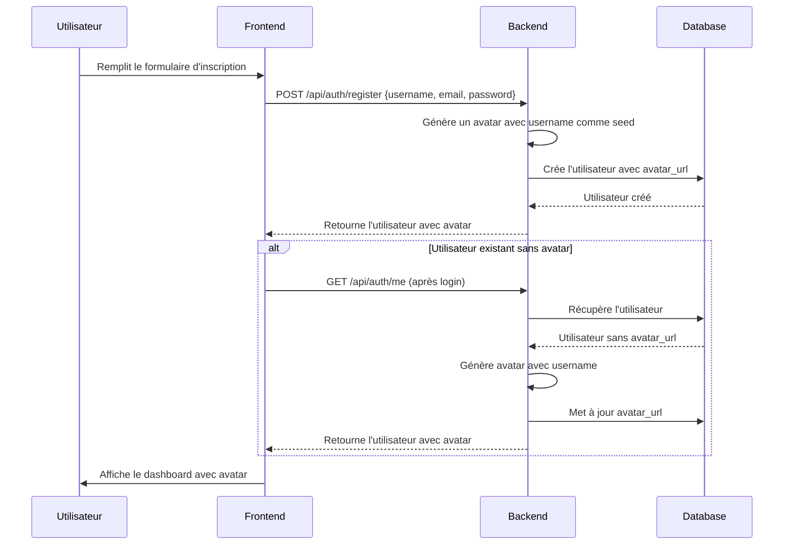

# 🎨 Flux de création d'avatar à l'inscription

Ce diagramme montre comment un avatar est généré lors de l'inscription d'un nouvel utilisateur.

```mermaid
sequenceDiagram
    participant Utilisateur
    participant Frontend
    participant Backend
    participant Database

    Utilisateur->>Frontend: Remplit le formulaire d'inscription
    Frontend->>Backend: POST /api/auth/register {username, email, password}
    Backend->>Backend: Génère un avatar avec username comme seed
    Backend->>Database: Crée l'utilisateur avec avatar_url
    Database-->>Backend: Utilisateur créé
    Backend-->>Frontend: Retourne l'utilisateur avec avatar

    alt Utilisateur existant sans avatar
        Frontend->>Backend: GET /api/auth/me (après login)
        Backend->>Database: Récupère l'utilisateur
        Database-->>Backend: Utilisateur sans avatar_url
        Backend->>Backend: Génère avatar avec username
        Backend->>Database: Met à jour avatar_url
        Backend-->>Frontend: Retourne l'utilisateur avec avatar
    end

    Frontend->>Utilisateur: Affiche le dashboard avec avatar
```
