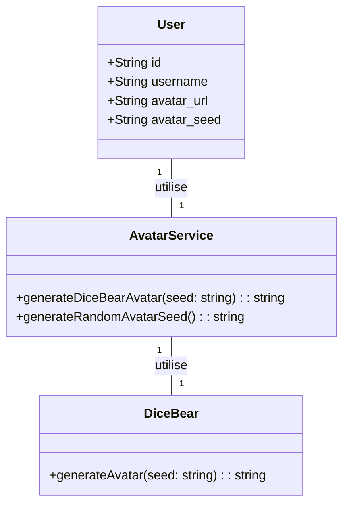
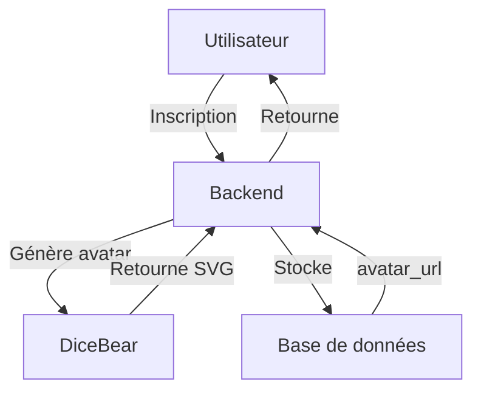

# 🏗️ Architecture des avatars

Ce document explique l'architecture complète de la gestion des avatars.

## Composants



## Flux de données



## Configuration

La collection par défaut est définie dans `src/lib/dicebear.ts`:
```typescript
const DEFAULT_COLLECTION: CollectionName = 'avataaars';
```

Pour changer le style pour tous les utilisateurs, modifiez cette constante et redémarrez le serveur.
