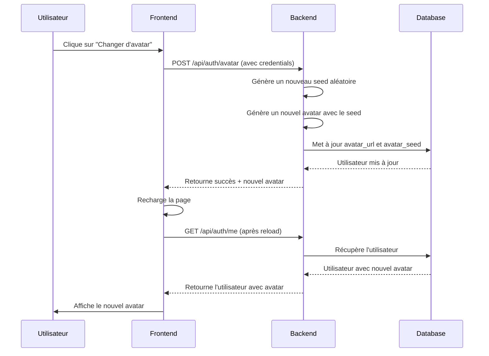

# 🔄 Flux de changement d'avatar

Ce diagramme montre comment un utilisateur peut changer son avatar.

```mermaid
sequenceDiagram
    participant Utilisateur
    participant Frontend
    participant Backend
    participant Database

    Utilisateur->>Frontend: Clique sur "Changer d'avatar"
    Frontend->>Backend: POST /api/auth/avatar (avec credentials)
    Backend->>Backend: Génère un nouveau seed aléatoire
    Backend->>Backend: Génère un nouvel avatar avec le seed
    Backend->>Database: Met à jour avatar_url et avatar_seed
    Database-->>Backend: Utilisateur mis à jour
    Backend-->>Frontend: Retourne succès + nouvel avatar

    Frontend->>Frontend: Recharge la page
    Frontend->>Backend: GET /api/auth/me (après reload)
    Backend->>Database: Récupère l'utilisateur
    Database-->>Backend: Utilisateur avec nouvel avatar
    Backend-->>Frontend: Retourne l'utilisateur avec avatar
    Frontend->>Utilisateur: Affiche le nouvel avatar
```
